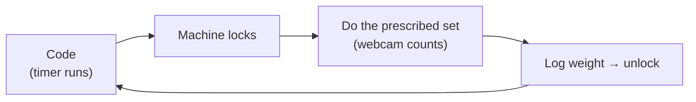

# reps-for-claude

A fitness pomodoro that kicks you off the computer. You code for a while, the
whole machine locks, and the lock screen prescribes a set — squats, bench,
jump rope — from your **weekly goals**. The webcam counts your reps, you log
the weight, and the machine unlocks. Repeat all day.

**Full docs:** [`_docs/`](_docs/index.md) — plain-English pages with diagrams
covering [the loop](_docs/concepts/the-loop.md),
[weekly goals](_docs/concepts/weekly-goals.md),
[rep detection](_docs/concepts/detection.md), and the
[roadmap](_docs/about/roadmap.md).

## Status

Ground-up rewrite in progress per
`docs/superpowers/specs/2026-07-19-tauri-rewrite-design.md`, now built on
[usb-mcp-hub](../usb-mcp-hub) as its vision SDK per
`docs/superpowers/specs/2026-07-21-hub-as-sdk-design.md`:

- `app/` — Tauri + React desktop app. The Rust core supervises a bundled
  hubd and drives it through the `hub-client` crate (enable metric on
  workout start, landmarks/progress/events back, honor-mode fallback).
- `vision/` — the Python model, packaged as the hub plugin
  (`reps_vision.hub_plugin`). Workout definitions and the model declaration
  ship from `app/src-tauri/resources/exercise_specs.json`.
- Calibrate exercises from your phone with the hub's snapshot tuning app
  (capture frames + describe in natural language, tune thresholds live).

Verify: `node scripts/e2e-latency.mjs` (full pipeline + latency budget),
`./scripts/bundle-hub.sh` (stage the pinned hub bundle), suites per
`docs/checklists/e2e-target-machine.md`.

## Movement Studio

The hub's `/studio.html` provides reviewed recordings, AI-assisted configuration,
held-out evaluation, and version activation. New workouts use the active version
of their movement; existing presets remain available until qualification.
See [setup and release qualification](docs/production/movement-studio.md).

## Debug mode

The desktop app opens in **Debug** on first launch. The **Debug / Workout**
switch stays visible in release builds and remembers your choice. Switching
modes restarts the app and stops the detector first.

Debug starts idle in a normal movable window. Use **Start camera**, **+1**,
**Done**, and **Stop test** to test manually, or open **Video inspection** for
the bundled squat clip. Video inspection displays the legacy counter preview;
it does not award workout credit. **Open gym window** opens an optional second
window, which can be closed and reopened.

Debug uses temporary workout and hub data, so simulated sets do not change your
real history or daily completion. Closing the main window exits and releases
owned camera processes. Workout mode enables the automatic timer and window
lock behavior. The emergency release remains **Ctrl+Shift+Backspace held for
three seconds**.

In Debug, choose an **Exercise** in the bottom toolbar, then press **F2 Start
camera**. All shipped detectors are available regardless of the daily routine.
Changing the selection during a test restarts detection with a fresh count.
Lift tests target 10 reps; jump rope targets 60 seconds and stretching 30 seconds.
