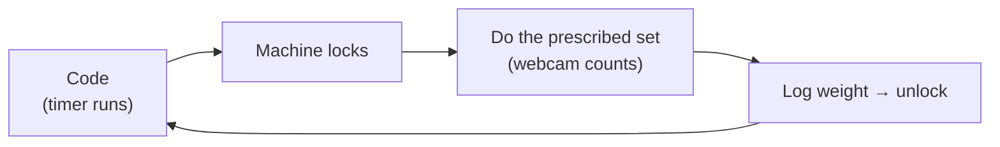
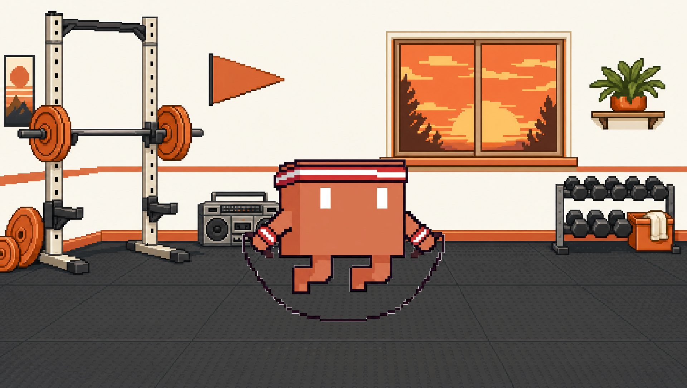

<div align="center">


**Small workouts. A little more often. Between prompts.**

[](https://github.com/factory-level/reps-for-prompts/actions/workflows/quality.yml)
[](LICENSE)
[](#install)

</div>

---

RFP is a fitness pomodoro for people who work with coding agents. While Codex or
Claude is running, a timer runs too. When it fires, the machine locks and the
lock screen prescribes a set from your weekly goals — squats, bench, jump rope.
Your webcam counts the reps, you log the weight, and the machine unlocks.

**The video never leaves your machine.** Pose estimation runs locally against a
bundled vision hub; nothing is uploaded unless you explicitly configure sync.



<div align="center">

</div>

## Install

Linux desktop, and you will need:

- **Node ≥ 22.5** (the hub uses `node:sqlite`) and **pnpm**
- **[uv](https://docs.astral.sh/uv/)** for the Python vision environment
- a **webcam**, and a sibling checkout of
  [usb-mcp-hub](https://github.com/factory-level/usb-mcp-hub) to build the bundle

```sh
git clone https://github.com/factory-level/reps-for-prompts.git
cd reps-for-prompts
pnpm install && (cd vision && uv sync)

./scripts/bundle-hub.sh                          # stage the pinned vision hub
pnpm --dir app build
(cd app/src-tauri && cargo build --release --workspace)
python3 scripts/install-dogfood.py
```

The installer puts binaries and resources under `~/.local/lib/rfp`, links
`rfp` into `~/.local/bin`, registers a user systemd service and a login
autostart entry, and keeps your workout history in `~/.local/share/rfp`. It
never deletes history, and it backs up the database before migrating it.

To stop it starting at login: remove `~/.config/autostart/rfp.desktop` and
`systemctl --user stop rfp.service`. Keep the data directory to keep your history.

## Usage

The app sits in the tray and watches for a coding agent being open — process
presence only, never prompts or transcripts. Everything is also driveable from
the CLI:

```sh
rfp status                      # what's happening right now
rfp start                       # start the next workout, open the display
rfp finish --weight 135         # save a detected set
rfp snooze --minutes 15         # not now
rfp history --limit 50          # local, read-only, no camera
rfp summary --from 2026-09-01
rfp service status|logs         # the background service
```

Every command takes `--json`. `rfp --help` lists the full surface. Set
`REPS_APP_HOME` to point at an isolated data directory.

The app opens in **Debug** mode on first launch, which uses throwaway workout
data so test sets never touch your real history. The **Debug / Workout** switch
stays visible in release builds. Emergency escape is
**Ctrl+Shift+Backspace held for three seconds**.

## How it works

| Piece | What it does |
|---|---|
| `app/` | Vite + React 19 frontend in a Tauri 2 shell |
| `app/src-tauri/engine/` | Pure workout/session state machine — no hub, no I/O. The testable core. |
| `app/src-tauri/hub-client/` | The SDK boundary: WebSocket client, fake hub for tests, supervisor for the bundled `hubd` |
| `app/src-tauri/reps-cli/` | The `rfp` binary |
| `vision/` | `reps_vision`, the Python pose model, packaged as a hub plugin |
| `web/` | Next.js activity site (account-free, opt-in) |

Vision is not built in-house. RFP bundles
[usb-mcp-hub](https://github.com/factory-level/usb-mcp-hub) as its vision SDK and
subscribes to *semantic events* (`rep_completed`) rather than frames. If the hub
is unavailable the app falls back to honor mode — it never strands you, and it
never awards a rep it did not see.

Exercises are declared in `app/src-tauri/resources/exercise_specs.json`; a new
one needs a known activity there *and* support in `reps_vision`.

**Docs:** [human guide](docs/wiki/index.md) ·
[architecture](docs/architecture/index.md) · [design](docs/design/index.md) ·
[detection and sensitivity](docs/wiki/concepts/detection.md) ·
[debug mode](docs/wiki/debug-mode.md) ·
[movement studio](docs/production/movement-studio.md) ·
[dogfooding and CLI setup](docs/production/rfp-dogfood.md)

## Development

```sh
(cd app && pnpm tauri dev)                     # hub auto-starts
(cd app && pnpm vitest run && pnpm tsc --noEmit)
(cd app/src-tauri && cargo test --workspace)   # --workspace is load-bearing
(cd vision && uv run pytest)
./scripts/free-hub.sh                          # when "nothing is detected"
```

See [CONTRIBUTING.md](CONTRIBUTING.md) for the full loop, including the
cross-repo bundle step after any hub change.

## Activity site

An optional, account-free site shows workout consistency between prompts.
Sync and public posting are off until you configure them, are scoped per
dataset, and are rate limited to six posts per hour. See
[web/README.md](web/README.md).

## License

[MIT](LICENSE) © RFP contributors
