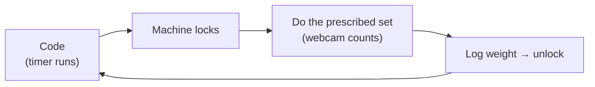

# reps-for-claude

A fitness pomodoro that kicks you off the computer. You code for a while, the
whole machine locks, and the lock screen prescribes a set — squats, bench,
jump rope — from your **weekly goals**. The webcam counts your reps, you log
the weight, and the machine unlocks. Repeat all day.

**Full docs:** [`_docs/`](_docs/index.md) — plain-English pages with diagrams
covering [the loop](_docs/concepts/the-loop.md),
[weekly goals](_docs/concepts/weekly-goals.md),
[rep detection](_docs/concepts/detection.md), and the
[roadmap](_docs/about/roadmap.md).

## Status

Ground-up rewrite in progress per
`docs/superpowers/specs/2026-07-19-tauri-rewrite-design.md`:
`app/` is the Tauri + React desktop app; `vision/` is the Python
pose-detection sidecar (`cd vision && uv run pytest`).
