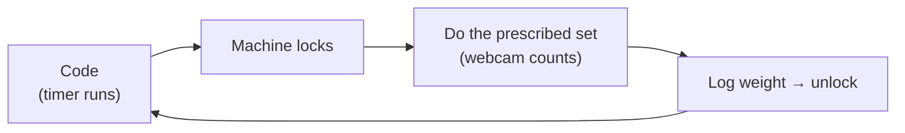

# reps-for-claude

A fitness pomodoro that kicks you off the computer. You code for a while, the
whole machine locks, and the lock screen prescribes a set — squats, bench,
jump rope — from your **weekly goals**. The webcam counts your reps, you log
the weight, and the machine unlocks. Repeat all day.



**Full docs:** [`_docs/`](_docs/index.md) — plain-English pages with diagrams
covering [the loop](_docs/concepts/the-loop.md),
[weekly goals](_docs/concepts/weekly-goals.md),
[rep detection](_docs/concepts/detection.md), and the
[roadmap](_docs/about/roadmap.md).

**Status:** the headless core (goal math, weekly log, streaming rep/timer
activities) is built and fully tested. The lock loop (`reps session`) and the
scoreboard/lock-screen UI are the next two plans. The CLI still carries the
legacy bank-then-spend commands until then.

## Install

```sh
uv sync
uv run reps init          # writes ~/.config/reps-for-claude/config.toml
```

For webcam pose counting, install the CV extra and switch the detector:

```sh
uv sync --extra cv         # mediapipe + opencv; pose model downloads once (~5MB)
# config.toml: [detector] name = "mediapipe"
```

## Use

```sh
reps analyze workout.mp4 -e pushup             # count reps in a video (never credits)
reps analyze workout.mp4 -e pushup --show      # live detection window (press q)
reps analyze workout.mp4 -e pushup -o out.mp4  # write an annotated video

# Legacy credit model (retired in Plan B):
reps earn pushup                       # count reps, bank credit
reps status                            # plan progress, balance, cap state
reps finish                            # end-of-day Form report for your trainer
```

See `docs/demo/` for a sample annotated detection clip.

## Configuration

`~/.config/reps-for-claude/config.toml` (see `reps init` for a commented
sample, and [`_docs/reference/config.md`](_docs/reference/config.md) for every
field): weekly goals (`[goals.weekly]`), the coding timer (`[session]`),
break sizes (`[break]`), camera (`[detector]`), and the lock (`[lock]`).

Set `REPS_HOME` to relocate config + state (used by the test suite).

## Development

```sh
uv run pytest                                # unit suite (no camera, no model)
uv run python scripts/fetch_fixtures.py      # download CC-licensed workout clips
uv run pytest -m cvvideo                     # real pose estimation over the clips
uvx --with mkdocs-material mkdocs serve      # preview the wiki locally
```

State is plain JSON with atomic writes; corrupt files reset safely instead of
crashing (details: [`_docs/concepts/storage.md`](_docs/concepts/storage.md)).
Design history lives in `docs/superpowers/specs/`; the current design is
`2026-07-19-workout-lock-display-design.md`.
