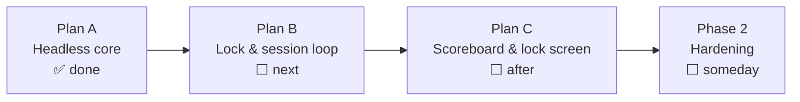

# Roadmap

**What this page tells you:** what is built, what comes next, and what is left out on purpose.

## Where the project is

## Plan A — headless core (done)

Everything that could be built and tested without a camera, a lock, or a UI:

- Config sections for the new model (`[session]`, `[goals.weekly]`, `[break]`, `[display]`, `[lock]`).
- `goals.py` — weekly progress and the "most behind" prescription.
- `weekly.py` — the per-week log of reps, pounds, and cardio seconds.
- `duesstate.py` — the dues flag behind a swappable interface.
- The three streaming activities: lift, jump rope, stretch.
- The weekly-volume section of the trainer report.
- Removal of the old `guard`/`shim` wrapper commands.

152 tests, all green, no hardware needed.

## Plan B — lock & session loop (next)

The part that makes it real:

- `locker.py` — drive `xsecurelock`: lock with our workout screen, unlock when dues are paid or the override password is used. Degrades politely if `xsecurelock` is missing.
- `session.py` — the CODING → LOCKED → PAID state machine, built around fake clocks and fake lockers so it is fully testable. Always releases the lock on a crash.
- `reps session` — the one command you live in all day.
- Retire the legacy `earn` / `status` / `balance` credit surface.

## Plan C — scoreboard & lock screen (after)

The part that makes it fun:

- A tiny local web server (localhost only) streaming session state over a WebSocket.
- `scoreboard.html` — the second-monitor view while coding: countdown, weekly goal bars, today's totals, streak.
- `lock.html` — the lock-screen view: the prescribed exercise, a live rep counter, and an animated Claude mascot (GSAP) doing the exercise with you.

## Phase 2 — hardening (someday)

- A root-owned system service holds the dues flag, so you cannot edit a file to skip a workout.
- A deliberately expensive override: forced delay plus a long passphrase, logged as a skipped workout.
- Better resistance to killing the locker process.

## Out of scope, on purpose

- **Boot-time re-lock.** Rebooting is an accepted escape. The lock only needs to cost more effort than the workout.
- **True rope-swing counting.** Bounce detection is honest and good enough to gate an unlock.
- **Posture checking for stretches.** The stretch timer is the honor system.
- **Wayland / other platforms.** The target is one machine: X11 on Linux Mint.
- **Cloud, accounts, social features.** This is a local tool for one developer and their trainer.
