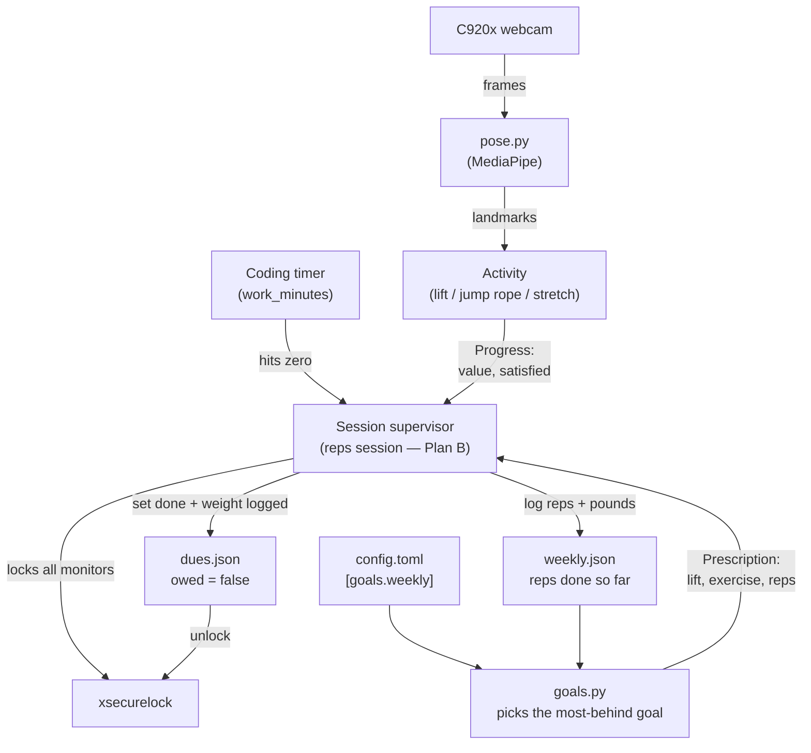
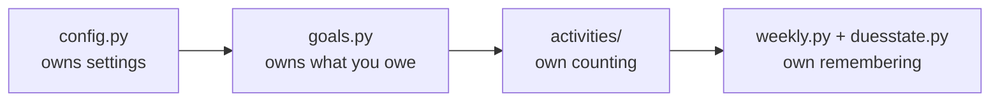

# The Big Picture

**What this page tells you:** how the whole system fits together, from the coding timer running out to the machine unlocking again.

## The system in one diagram

Read it top to bottom. Each arrow is explained below.

## Walkthrough, arrow by arrow

### Coding timer → session supervisor

You launch `reps session` when you sit down to work. It starts a countdown — by default six minutes of coding (`work_minutes` in config). While the timer runs, you code normally in any app. Nothing watches you and the camera is off. When the timer hits zero, the supervisor moves to the LOCKED state.

> Note: the supervisor is Plan B and does not exist yet. Today the pieces below it (goals, activities, stores) are built and tested, but nothing drives them end to end.

### Config + weekly log → goals

Your config file lists weekly rep targets, like `squat = 60`. The weekly log knows how many reps you have already done this week. `goals.py` compares the two and answers one question: **which goal is furthest behind?** That exercise becomes the *prescription* — the set you owe, for example "10 squats."

### Session → xsecurelock

*xsecurelock* is a standard Linux screen locker. The supervisor launches it to lock every monitor for real — keyboard and mouse grabbed, no switching away. The lock screen shows the prescription. The goal is not to be unbreakable (you own the machine; a reboot always wins). The goal is that skipping the workout costs more effort than doing it.

### Webcam → pose detection → activity

While locked, the camera turns on. Each video frame goes to MediaPipe, which finds your body's *landmarks* — the positions of joints like hips, knees, and elbows. The landmarks feed an *activity*, a small counter that tracks one kind of exercise:

- **Lift** — counts reps by watching a joint angle bend and straighten.
- **Jump rope** — a timer that only runs while you are bouncing.
- **Stretch** — a plain hold timer.

See [Counting your reps](detection.md) for how each one works.

### Activity → dues paid → unlock

Every frame, the activity reports progress: how many reps (or seconds) so far, and whether the target is met. When it is, the app asks one question — "what weight did you use?" — logs the set, marks your dues as paid, and releases the lock. The camera turns off, the timer resets, and you are back to coding.

## Who owns what

| Owner | Owns | Never does |
|---|---|---|
| `config.py` | Reading and validating every setting | Storing progress |
| `goals.py` | Deciding which exercise to prescribe | Talking to files or cameras (pure math) |
| `activities/` | Turning pose frames into live progress | Deciding targets; saving anything |
| `weekly.py`, `duesstate.py` | Saving progress and dues to disk safely | Counting or prescribing |

This separation is why the core could be built and tested with no camera, no lock, and no UI: every piece has one job and talks through small, plain interfaces.
