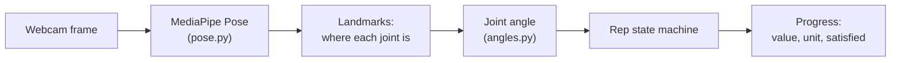
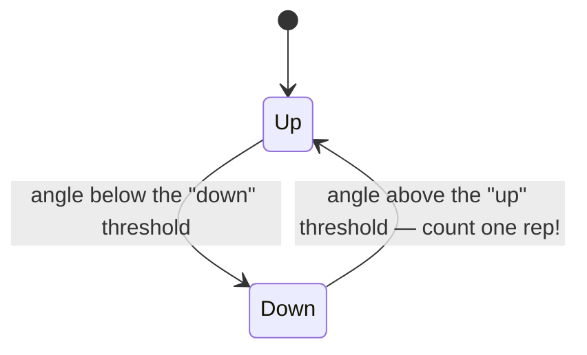

# Counting Your Reps

**What this page tells you:** how a webcam frame becomes a counted rep, a jump-rope second, or a finished stretch.

## The pipeline

1. **The camera produces frames** — ordinary video images, about 30 per second.
2. **MediaPipe finds your body.** *MediaPipe Pose* is a free computer-vision model from Google. Given one frame, it returns *landmarks*: the position of each joint (shoulder, elbow, hip, knee...) as x/y coordinates, plus a confidence score. `pose.py` is the only file in the project that talks to MediaPipe.
3. **Geometry turns landmarks into an angle.** For a squat, the app looks at the hip–knee–ankle angle. Standing straight is about 170°; deep in a squat is under 110°. `angles.py` is pure math — no camera, no files.
4. **A state machine counts the rep.** More on this below.
5. **An activity reports progress.** Every frame, the current activity answers: how much is done (`value`), in what unit (`reps` or `seconds`), and is the target met (`satisfied`)?

## How a rep is counted

A rep is one full cycle: **up → down → up**. The state machine tracks which half of the cycle you are in:

Each exercise defines its two thresholds in `exercises.py` (for the squat: down below 110°, up above 160°). Using two separate thresholds means small wobbles near the middle never count as reps — you must clearly go down and clearly come back up.

If MediaPipe loses you for a frame (you stepped out of view), nothing is counted and nothing resets. The count just waits for you to come back.

## The three activities

All three follow the same tiny contract (`activities/base.py`): feed in one frame's landmarks and the current time, get back a `Progress`.

### Lift — count reps

`LiftActivity` is the pipeline above. Target = the prescribed reps. Done when the count reaches the target. The weight-in-pounds question comes after, from the UI — the camera cannot see how much iron is on the bar.

### Jump rope — a timer gated by motion

`JumpRopeActivity` does not count rope swings. It runs a stopwatch that only ticks **while you are bouncing**:

- It watches the height of your hips frame to frame.
- Moved enough since the last frame? You are bouncing — the clock runs.
- Standing still for more than the grace period (2 seconds by default) resets the streak to zero.

So "60 seconds of jump rope" means 60 seconds *in a row*, with short trips and rope-resets forgiven.

> Honest limitation: this measures sustained bouncing, not true rope swings. It is good enough to gate an unlock, and thresholds should be tuned against real footage of you.

### Stretch — a plain timer

`StretchActivity` is the honor system: the clock starts on the first frame and is satisfied after the target seconds. It ignores landmarks entirely — checking your actual posture is out of scope for Phase 1.

## Trying it without a camera

The whole pipeline is testable with no hardware. Tests feed hand-made landmark positions and fake clock times straight into the activities. There is also `reps analyze video.mp4 -e squat` to run real detection over a video file, draw the skeleton on it, and show the count — it never credits anything, it just shows you what the detector sees. A sample annotated clip lives in `docs/demo/`.
