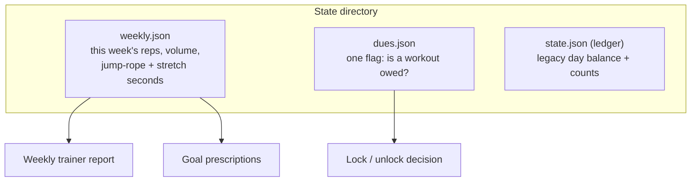
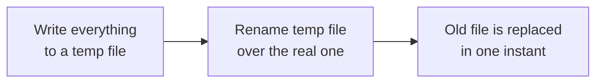

# Remembering Your Progress

**What this page tells you:** the small JSON files the app keeps on disk, and the two rules that stop them from ever losing your data.

## What is stored, and where

Everything lives in plain JSON files under `~/.local/state/reps-for-claude/` (or `$REPS_HOME/state` if that variable is set — the test suite uses this to stay out of your real files).

| File | What it remembers | Who reads it |
|---|---|---|
| `weekly.json` | Reps per exercise, lifted volume in pounds, cardio seconds — for the current ISO week | Goal math, the scoreboard, the trainer report |
| `dues.json` | One boolean: does the machine currently owe a workout? | The lock loop (Plan B) |
| `state.json` | The legacy daily ledger from the old bank-then-spend model | The legacy CLI commands |

No database, no server, no cloud. You can open any of these files in a text editor and read them.

## Rule 1: writes are atomic

*Atomic* means all-or-nothing. The app never edits a state file in place. Instead it:

Renaming a file is instantaneous on Linux. So even if the power dies mid-write, the real file is either the complete old version or the complete new version — never a half-written mess.

## Rule 2: corruption never crashes anything

If a state file is missing or unreadable (bad JSON, wrong shape), the app does **not** crash. It prints a warning and starts from a safe empty state:

- A corrupt `weekly.json` becomes a fresh, empty week.
- A corrupt `dues.json` reads as "no workout owed" — it *fails open*. A broken file must never lock you out of your own computer.

Losing a week of stats is annoying. Being trapped by a crashed locker is unacceptable. The failure rules are chosen so the worst case is always the annoying one, never the unacceptable one.

## Why dues has an interface

`duesstate.py` defines a tiny contract — `owed()` and `set_owed()` — and today one implementation: a plain file you own. That is deliberate. In Phase 2, a privileged system service can own the dues flag in a root-owned file (so you cannot just edit your way out of a workout), and it will slot in behind the same contract without any other code changing.
