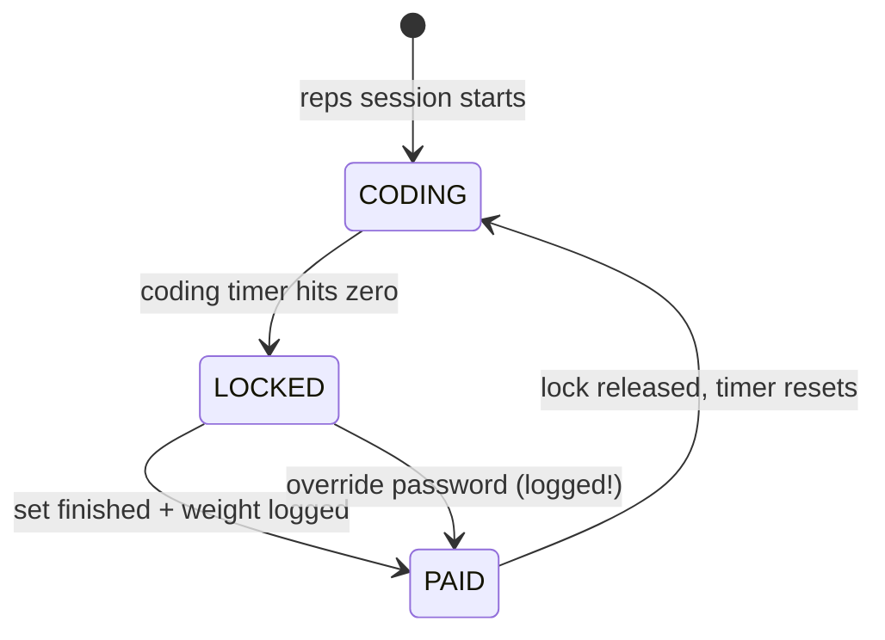

# The Loop

**What this page tells you:** the three states the app moves through all day — CODING, LOCKED, and PAID — and what happens in each one.

## The states in one diagram

The loop has no end state. You ride it all day: code, lock, lift, unlock, repeat.

## CODING — you work, nothing bothers you

- The machine is unlocked. You code in any app you like.
- A countdown runs: `work_minutes` of coding time (default: 6 minutes).
- The second monitor shows the *scoreboard* (Plan C): the countdown, your weekly goal bars, and today's totals.
- **The camera is off.** It only turns on while the machine is locked. That is a privacy rule, not an accident.

When the countdown hits zero, the machine locks. That's the whole trigger — no judgment, no snooze button.

## LOCKED — the machine is closed until you move

- `xsecurelock` grabs every monitor, the keyboard, and the mouse.
- The lock screen shows your *prescription* — one set of the weekly goal you are furthest behind on, for example "10 squats." You can swap it for a different lift, or for jump rope, but you cannot swap it for nothing.
- The camera turns on. Your reps count up live on screen as you do them.
- Finished the set? The app asks **"what weight did you use?"** You type the pounds, and the payment is complete.

Jump rope and stretching skip the weight question — they are timed instead of counted.

### The escape hatch

Every state has an override: a password that unlocks without exercise. Using it is always written to the log — so at the end of the week, you and your trainer can both see exactly how many workouts you skipped. In Phase 2 the override gets deliberately more annoying (a forced delay plus a long passphrase).

## PAID — the good part

- A short celebration plays.
- The camera turns off.
- The lock releases, your set (reps + pounds) lands in the weekly log, and dues are marked paid.
- The coding timer resets, and you are back in CODING.

## What happens if things break?

The loop is designed to *never trap you*:

| Problem | What happens |
|---|---|
| The supervisor crashes while locked | The lock is always released on the way down (`try/finally`). You are never stranded. |
| `xsecurelock` is not installed | You get a clear warning and a best-effort fullscreen window instead. The loop keeps going. |
| The camera is unplugged | The break falls back to the honor system — never phantom reps, never a dead end. |
| A state file on disk is corrupt | It resets to a safe empty state with a warning. Nothing crashes. |

> Note: the state machine itself is Plan B and is not built yet. The rules on this page come from the Phase 1 design spec (`docs/superpowers/specs/2026-07-19-workout-lock-display-design.md`).
