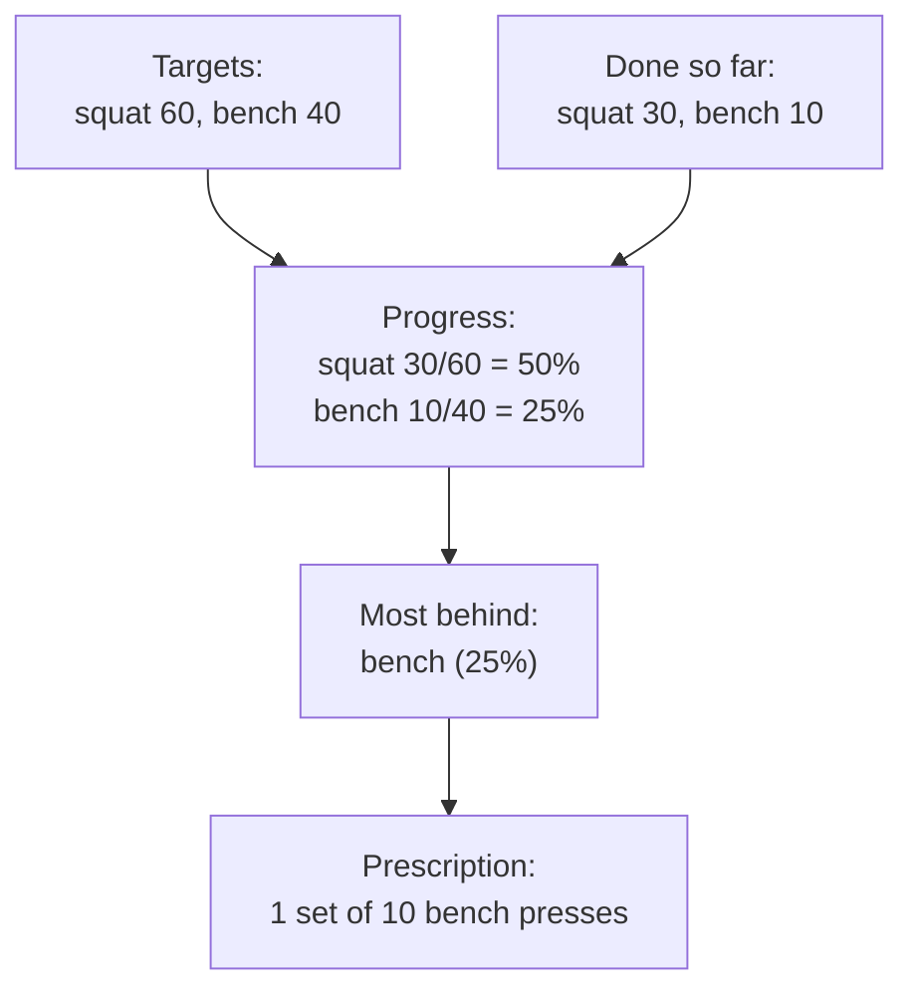
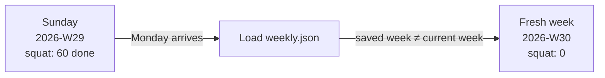

# Weekly Goals

**What this page tells you:** how the app decides which exercise you owe at each lock, and how your week's progress is tracked.

## The idea

You do not plan workouts day by day. You set **weekly rep targets** in your config:

```toml
[goals.weekly]
squat = 60
bench = 40
row = 40
```

That says: "by the end of this week I want 60 squats, 40 bench presses, and 40 rows." The app's job is to spread that work across all the locks that happen during the week — one set at a time.

Miss a day? Nothing resets, nothing punishes you. The remaining reps are still there, and the app just keeps prescribing from what is left.

## How a prescription is picked

At each lock, the app asks: **which goal is furthest behind?** "Behind" is measured as a fraction — reps done divided by reps targeted.



In this example bench is only 25% done while squat is 50% done, so the lock screen prescribes bench. The set size comes from `default_reps` in config (default: 10). If two goals are tied, the app picks by name, so the choice is always predictable.

You can override the pick on the lock screen — choose a different lift, or jump rope — but the auto-pick means you never have to think about it.

When **every** goal is met, there is nothing left to prescribe. The remaining locks that week fall back to jump rope or stretching, so you still move without piling on more lifting.

## How progress is counted

Every finished set is added to the **weekly log**:

- **Reps** per exercise (10 squats → `squat: 10`).
- **Volume** per exercise — reps times the weight you entered, in pounds. Ten squats at 45 lbs adds 450 lbs of volume. Volume is what your trainer reads to see how hard the week really was.
- **Jump rope seconds** and **stretch seconds**, tracked as running totals.

## The week rolls over on its own

The log is keyed to the *ISO week* — a standard calendar label like `2026-W29` that runs Monday through Sunday. When the app loads the log and finds the saved week is not the current week, it simply starts a fresh, empty week. There is no cron job and no cleanup step; the rollover happens the first time you use the app in a new week.



The code that does all this lives in two small modules: `goals.py` (pure math, no files) and `weekly.py` (the log on disk). See the [module map](../reference/modules.md).
