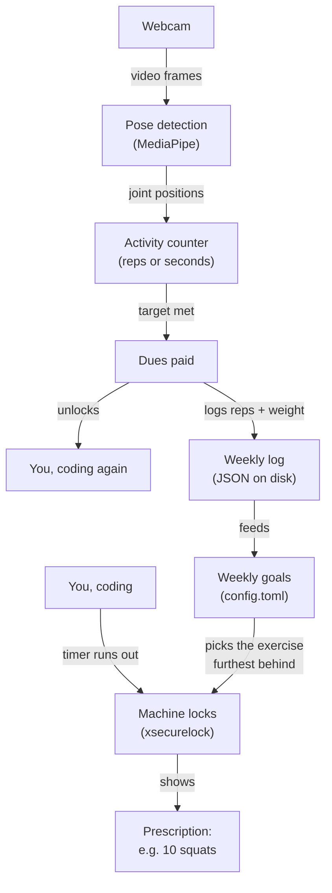

# Reps for Claude

**What this page tells you:** what this app is, how its pieces fit together, and where to read next.

## What is this?

Reps for Claude is a fitness timer that kicks you off your computer. You code for a while. Then the whole machine locks. To unlock it, you do a set of exercise — squats, bench press, jump rope — and a webcam counts your reps. Then you code again. All day, the loop repeats.

Think of it as a pomodoro timer where the "break" is a workout, and the workout is not optional.

Three ideas drive the design:

1. **The machine locks. You don't argue with it.** When the coding timer runs out, a real screen lock takes over every monitor. The lock screen tells you exactly which exercise to do. Doing the set is the only easy way back in. (Rebooting always works — the lock is meant to be more annoying to skip than the workout is to do.)
2. **The camera is the referee.** A webcam watches you exercise. Pose detection (MediaPipe) finds your joints in each frame and counts real reps. No clicking "I did it, I promise."
3. **Weekly goals decide what you do.** You set weekly rep targets, like 60 squats and 40 bench presses. At each lock, the app prescribes one set of whichever goal is furthest behind. By the end of the week, everything gets done.

## The big picture

Read it top to bottom: the timer locks the machine, your weekly goals pick the exercise, the camera counts it, and finishing the set unlocks the machine and updates your progress.

## How much of this is built?

The project is being built in three plans. Be honest with yourself about which parts exist today.

| Plan | What it covers | Status |
|---|---|---|
| **Plan A — headless core** | Config, weekly-goal math, progress stores, streaming exercise counters. No UI, no lock. | **Done.** Fully unit-tested. |
| **Plan B — lock & session loop** | The real screen lock (`xsecurelock`), the CODING→LOCKED→PAID state machine, the `reps session` command. | Not started. |
| **Plan C — scoreboard & lock screen** | A local web page with the countdown, goal bars, and an animated Claude mascot on the lock screen. | Not started. |

> Note: the CLI still carries commands from an older design (`earn`, `status`, `balance`, `finish`) where reps banked "Claude time" like money. That model is being replaced by the lock loop. See [Roadmap](about/roadmap.md).

## Reading guide

| Page | What it tells you |
|---|---|
| **Concepts** | |
| [The big picture](concepts/big-picture.md) | The whole system on one page, arrow by arrow. |
| [The loop](concepts/the-loop.md) | The three states — CODING, LOCKED, PAID — and how you move between them. |
| [Weekly goals](concepts/weekly-goals.md) | How the app decides which exercise you owe. |
| [Counting your reps](concepts/detection.md) | How a webcam frame becomes a counted rep. |
| [Remembering your progress](concepts/storage.md) | The three small files on disk and why they never lose your data. |
| **Reference** | |
| [Configuration](reference/config.md) | Every setting in `config.toml`. |
| [CLI commands](reference/cli.md) | Every `reps` command, including the legacy ones. |
| [Module map](reference/modules.md) | What each Python file does. |
| **About** | |
| [Roadmap](about/roadmap.md) | What exists, what's next, and what is out of scope on purpose. |
| [Glossary](about/glossary.md) | Plain-English definitions of every term in these docs. |
