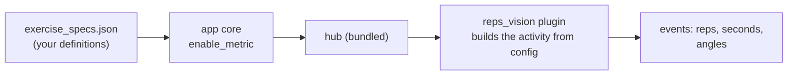

# Adding and Tuning Exercises

**What this page tells you:** how to teach the app a new pose-counted
exercise, how to tune its thresholds with your phone, and how to verify it
before trusting it with your lock screen.

## Where an exercise lives

Since the hub-SDK migration, one file is the source of truth:
`app/src-tauri/resources/exercise_specs.json`. It declares two things:

1. **The model** the app uses for pose detection (`model` block — currently
   MediaPipe pose landmarker, *lite* variant, served by the `reps_vision`
   plugin). You never edit this to add an exercise.
2. **The exercises** — one entry each. When a workout starts, the app sends
   the entry (plus your target and camera) to the vision hub, which forwards
   it to the plugin. The detection engine itself knows no exercise names;
   whatever is in this file is what exists.



## The three activity kinds

Every exercise is one of three kinds, matching the three kinds of
observation the plugin can make:

| Activity | Counts | Example | You configure |
|---|---|---|---|
| `lift` | discrete reps (**events**) | squat, bench | a joint triple + two angle thresholds |
| `jumprope` | time spent moving (**duration**) | jump rope | bounce sensitivity + grace period |
| `stretch` | a timed hold (**duration**) | stretch | hold seconds |

The live joint **angle** (a min/max **range**, 0–180°) is streamed alongside
for the overlay and for tuning.

## Adding a lift-type exercise

A lift is defined by *one joint angle crossing two thresholds*. One full rep
is: angle above the **up** threshold → below the **down** threshold → back
above **up**.

1. **Pick the joint triple.** Use side-less names — `shoulder`, `elbow`,
   `wrist`, `hip`, `knee`, `ankle` — as `[a, b, c]`; the angle is measured
   at the middle joint. The camera side (left/right) is chosen per frame by
   landmark visibility, so a side-on camera works either way.
   - Elbow movements (press, curl, row): `["shoulder", "elbow", "wrist"]`
   - Leg movements (squat, lunge): `["hip", "knee", "ankle"]`
2. **Guess starting thresholds.** Straight limb ≈ 160–180°, deep bend ≈
   60–110°. Start from a similar existing entry (a deadlift starts well from
   squat's numbers).
3. **Add the entry** to `exercise_specs.json`:

```json
"deadlift": {
  "activity": "lift",
  "exercise": {
    "name": "deadlift",
    "joints": ["hip", "knee", "ankle"],
    "downBelow": 120.0,
    "upAbove": 165.0,
    "minVisibility": 0.5
  }
}
```

`downBelow`/`upAbove`: the two thresholds in degrees. `minVisibility` (0–1):
how confident MediaPipe must be in a joint before it is trusted — raise it
if phantom reps appear when you are half out of frame.

4. **Put it in the rotation.** The specs file makes an exercise
   *detectable*; the rotation (in the app's SQLite settings) makes it
   *prescribed*. Until the rotation editor UI lands, add it to the seeded
   rotation in `app/src-tauri/engine/src/store.rs`.

For a duration exercise, copy the `jumprope` or `stretch` entry and adjust
`targetSeconds` / `bounceThreshold` / `resetAfter` (the grace period before
a pause resets your streak) or `holdSeconds`.

## Tuning with your phone

The hub ships a **snapshot tuning app** — a page served to your phone. The
mental model: *tune your design with natural language and frame capturing.*
You point a camera at yourself, watch the live numbers, and adjust until the
detection matches reality.

1. Start the app (the hub starts with it), or start the hub alone:
   `HUB_PLUGIN_ARGS="--plugin-path vision/src --plugin reps_vision.hub_plugin.plugin:RepsVisionPlugin" pnpm --filter @hub/hubd start`
   in the hub checkout.
2. Open the printed `https://<lan-ip>:8443/` URL on your phone, tap
   **Start camera**, and **Enable** the `reps_vision` plugin.
3. **Place the camera.** Do a slow rep and watch the live angle readout:
   your whole body in frame, side-on, and the angle sweeping smoothly
   through your movement. If it reads "no pose detected", step back.
4. **Note your real angles.** Read the angle at the top and bottom of a
   real rep. Your thresholds should sit *inside* that sweep with margin —
   e.g. if your squat reads 172° up / 95° down, `upAbove: 160` and
   `downBelow: 110` both get crossed decisively every rep.
5. **Drag the sliders.** The Tuning panel is generated from the plugin's
   config schema; changes apply live. Do ten real reps: the count must be
   exactly ten — no doubles from jitter, no misses from shallow thresholds.
6. **Capture and describe.** Snapshot the poses that matter (top, bottom,
   your usual camera framing) and write what you want detected in plain
   language, then **Save draft**. Today drafts are your notes; the planned
   AI authoring engine will turn frames + description into a config for
   you.
7. **Copy the tuned numbers back** into `exercise_specs.json`. For now this
   is manual — the JSON you ship is the config your workouts use.

## Verifying before you trust it

- **Unit-level:** the plugin's engine is config-driven and already tested;
  for a new joint pattern, add a case to `vision/tests/test_hub_plugin.py`
  with synthetic landmarks.
- **Against real video:** put a short clip in
  `vision/tests/fixtures/videos/` with an `expected_reps` entry in
  `manifest.json`, or point the e2e at it —
  `node scripts/e2e-latency.mjs` streams a fixture through the full
  pipeline and checks the count and latency.
- **In the loop:** run the app, start a workout with the new exercise, and
  watch the Operator panel count real reps into the session.

## Rules of thumb

- **Thresholds too tight** (close to your real extremes) → missed reps.
  **Too loose** (close to each other) → double counts from jitter. Keep
  ≥ 30–40° between `downBelow` and `upAbove` when the movement allows.
- One rep can never double-count within a cycle — the state machine
  requires a full down-then-up crossing — so when the count runs high, the
  camera is seeing a limb you didn't intend (raise `minVisibility`, or
  re-aim the camera).
- Tune with the clothes and lighting you actually train in; baggy layers
  move thresholds by 10° or more.

## Two-camera fusion (optional)

With two cameras the hub can track a set from both angles and elect the
best view per moment (occlusion-proof rep counting). Add a top-level
`cameras` block to `exercise_specs.json`:

```json
"cameras": {
  "registry": [
    { "cameraId": "front", "kind": "usb", "source": "v4l2:///dev/video0" },
    { "cameraId": "side",  "kind": "usb", "source": "v4l2:///dev/video1" }
  ],
  "set": ["front", "side"],
  "fusion": { "policy": "best", "scoreField": "visibility" }
}
```

On session start the app registers the cameras, enables the workout
metric across the set, and the hub fuses the streams: only the elected
primary's landmarks/events reach the app (`fused: true`,
`primary_camera_changed` on election flips). Per-camera tuning deltas
(e.g. a different `downBelow` for the side angle) are applied from the
hub's tuning app overlay editor.

Without the block everything behaves exactly as single-camera. Verify a
two-camera setup with:

```sh
node scripts/e2e-two-camera.mjs
```

It generates an occluded "front" fixture, streams both through
MediaPipe, and asserts the election fails over and the rep count
survives (requires the sibling `usb-mcp-hub` checkout; hub node >= 22.5).
