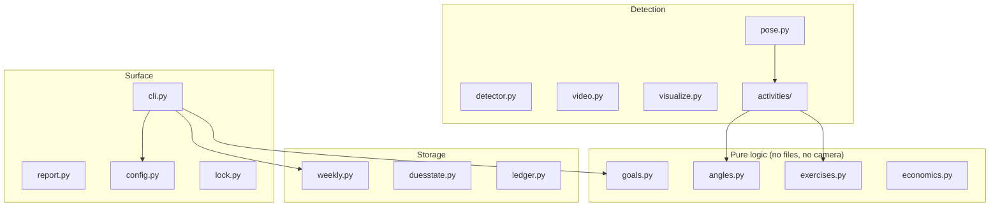

# Module Map

**What this page tells you:** what every Python file in `src/reps_for_claude/` does, in one line each, and how they layer.

## The layers

The pure-logic layer imports nothing but the standard library. Detection is the only place computer vision lives. Storage files never decide anything — they just remember.

## File by file

| Module | One-line job |
|---|---|
| **Core model** | |
| `goals.py` | Weekly-goal math: progress fractions, which goal is most behind, what to prescribe. Pure. |
| `weekly.py` | The per-ISO-week log: reps, lifted pounds, cardio seconds. Auto-resets each new week. |
| `duesstate.py` | One flag behind an interface: does the machine owe a workout? Fails open. |
| `config.py` | Loads and validates `config.toml`; owns all paths (`REPS_HOME` aware). |
| **Detection** | |
| `pose.py` | The only file that imports MediaPipe. Frame in, landmarks out. |
| `angles.py` | Joint-angle geometry and the up/down rep state machine. Pure. |
| `exercises.py` | Per-exercise specs: which joints to watch and the two angle thresholds. |
| `activities/base.py` | The `BreakActivity` contract: one frame in, live `Progress` out. |
| `activities/lift.py` | Counts lift reps using the angle state machine. |
| `activities/jumprope.py` | A stopwatch that only runs while your hips are bouncing. |
| `activities/stretch.py` | An honor-system hold timer. |
| `detector.py` | Rep counters behind one interface (keyboard now, camera pluggable). |
| `video.py` | Frame loop over a webcam or video file; everything injectable for tests. |
| `visualize.py` | Draws the skeleton, tracked joint, and rep count onto frames. |
| **Surface & legacy** | |
| `cli.py` | The `reps` commands. |
| `report.py` | The trainer report: Markdown + JSON, including weekly volume. |
| `lock.py` | Desktop-lock adapters; grows into the `xsecurelock` driver in Plan B. |
| `ledger.py` | The legacy daily balance ledger (old model; retired in Plan B). |
| `earn.py` | Legacy: one earn session — detector → economics → ledger. |
| `economics.py` | Legacy: pure credit math (seconds per rep, balance cap). |

## The house rules

Every module follows the same conventions, which is why the map stays this simple:

- **Pure logic is separated from IO.** Math modules never touch files or hardware, so tests need no mocks.
- **State files are written atomically and fail safe.** See [Remembering your progress](../concepts/storage.md).
- **Everything is testable headless.** `REPS_HOME` redirects all paths; landmarks and clocks can be faked. `uv run pytest` needs no camera, no model, no lock.
