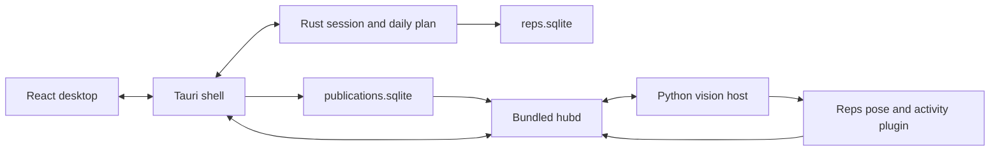

# Reps architecture as built

Reviewed against source on 2026-09-15. Intended behavior lives in
[design](../design/index.md); operating instructions live in the [wiki](../wiki/index.md).

## Source boundaries

| Component | Implementation and responsibility |
|---|---|
| Desktop | [lib.rs](../../app/src-tauri/src/lib.rs), [runtime.rs](../../app/src-tauri/src/runtime.rs): commands, mode isolation, routine loading and resource lookup |
| Session | [engine](../../app/src-tauri/engine/src/session.rs): Coding → ExerciseRequired → WorkoutActive → WeightConfirmation → Unlocked; daily-plan completion suppresses further locks |
| Daily plan | [plan.rs](../../app/src-tauri/engine/src/plan.rs): routine prescription and per-day completion |
| Local storage | [store.rs](../../app/src-tauri/engine/src/store.rs): settings, rotation, pointer state and exercise history in SQLite |
| Hub boundary | [hub.rs](../../app/src-tauri/src/hub.rs), [client](../../app/src-tauri/hub-client/src/client.rs), [supervisor](../../app/src-tauri/hub-client/src/supervisor.rs): metric lifecycle, session identity, owned process lifecycle and fallback |
| Publication recovery | [outbox.rs](../../app/src-tauri/hub-client/src/outbox.rs): durable FIFO queue, stable IDs, retry after acknowledgement loss |
| Vision | [Detection architecture](detection.md): legacy presets, versioned movements, jump rope and stretch |
| Packaging | [bundle-hub.sh](../../scripts/bundle-hub.sh): staged hub, plugin, model and consumer artifacts; [package evidence](../production/package-verification.md) |

## Design coverage and remaining work

Requirements: [production target](../../../usb-mcp-hub/docs/design/production-target.md).

| Requirement | As built | Evidence / remaining gap |
|---|---|---|
| App owns workouts; hub is generic | Hub-free engine plus Rust hub-client and external Reps plugin | Source boundaries above |
| Demonstrate → evaluate → activate | Studio manages candidates; desktop supplies movement ID and pins active rules at enable time | [Movement guide](../production/movement-studio.md); real-gym qualification remains pending |
| Noise-resistant rep detection | Temporal phases for versions; two thresholds for legacy presets | [Detection](detection.md); preset tuning is not an accuracy claim |
| Durable lifecycle publication | Desktop outbox retries stable event/command/result IDs | [Recovery guide](../production/movement-studio.md#publication-recovery); local state change and enqueue are not one transaction |
| Safe failure and release operation | Debug isolation, honor fallback, emergency escape, owned-child cleanup | [Target-machine checklist](../checklists/e2e-target-machine.md); physical failure tests and soak still required |
| Accurate, responsive camera operation | Automated software/video checks exist | [Readiness evidence](../production/software-readiness.md); gym accuracy and actual display latency remain release gates |

This page describes source behavior. It does not assert that a previously built
installer contains subsequent source changes.
